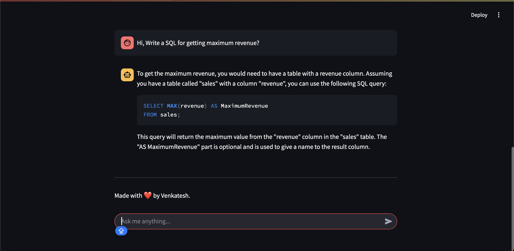

# Streamlit Chatbot with Snowflake Cortex AI

🚀 A Streamlit-based chatbot that allows users to ask data-related questions and gain insights from Snowflake Cortex AI. This chatbot enables interactive querying of Snowflake tables, providing real-time responses powered by Snowflake Cortex AI.

## 📌 Key Features
- ✅ Chat with **Snowflake Cortex AI** for data insights
- ✅ Simple **Streamlit UI** for interaction
- ✅ Secure connection to Snowflake



## Prerequisites
- **Snowflake Account or Trial Account**
- **Python IDE** like VSCode

## 🛠️ Installation

Clone the repository and navigate to the project directory:

``` bash
git clone https://github.com/ItisVenkatesh/streamlit-snowflake-cortex-ai.git
cd streamlit-snowflake-cortex-ai
```

## 🚀 Running the Project
1. Install dependencies:

    ``` bash
    pip install -r requirements.txt
    ```

2. Run streamlit to start the web application:

    ``` bash
    cd src
    streamlit run snowflake_chatbot_cortex_ai_complete.py
    ```

3. Configure Web App:

    - The streamlit app opens in your browser.
    - Choose the parameters to configure your snowflake account accordingly.
    - Just give the snowflake account prefix instead of whole URL below.
        For example, "xyz123" in xyz123.snowflakecomputing.com
    - If you do not have snowflake account, you can go for a trial account from snowflake.

4. Ask AI:
    Chat with your AI assistant.

5. To stop:
    Once done, come back to terminal, then press [ctrl + c].

## License

This project is licensed under the MIT License - see the LICENSE file for details.
